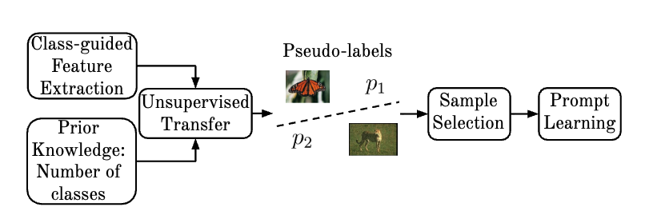

<br />
<div align="center">

  <h3><strong>Unsupervised Transfer Clustering for Mitigating Cold Start in Active Prompt Learning</strong></h3>

  <p>
    <a href="http://lattes.cnpq.br/2124329172651852" target='_blank'>André Portella</a><sup>1</sup>&nbsp;&nbsp;
    <a href="https://scholar.google.com/citations?user=QT362TYAAAAJ" target='_blank'>Samuel Felipe dos Santos</a><sup>1</sup>&nbsp;&nbsp;
    <a href="https://scholar.google.com/citations?user=VSc_vDMAAAAJ" target='_blank'>Jurandy Almeida</a><sup>1</sup>
  </p>

  <p>
    <sup>1</sup>Federal University of São Carlos&nbsp;&nbsp;
  </p>

  <p>
    <!-- <a href="https://arxiv.org" target="_blank"></a> -->
    <a href="https://arxiv.org" target="_blank"></a>
    <a href="https://andre-portella.github.io/UTC-project-page/" target="_blank"></a>
    <a href="https://github.com/andre-portella/UTC" target="_blank"></a>
    <a href="#" target="_blank"></a>
  </p>

</div>


## About
<p align="justify">
This repository contains the research project on Unsupervised Transfer Clustering (UTC), aimed at minimizing manual annotation effort in Computer Vision tasks. The project investigates whether integrating the TURTLE framework into Active Prompt Learning (APL) outperforms traditional $K$-Means clustering when selecting informative samples for manual labeling.
</p>
<p align="justify">
In the proposed pipeline, dataset samples are first pseudo-labeled. Subsequently, considering their embeddings and the probability distributions generated by the model, different selection criteria determine which instances will have their labels queried. 
</p>
<p align="justify">
The annotated samples are then used to optimize the learnable context vectors (prompt tokens), while keeping the base model's visual and textual encoders completely frozen. Prompt parameters are updated using the SGD optimizer with a momentum of 0.9 and an initial learning rate of 0.002, which decays over time according to a cosine annealing scheduler over 200 epochs per active learning round, utilizing a batch size of 32.
</p>

<p align="center">
  
  <br>
  <em>Overview of the UTC framework.</em>
</p>

---

## Dataset Preparation

Datasets supported:

* **Oxford Flowers**
* **Oxford Pets**
* **Describable Textures Dataset (DTD)**
* **Caltech-101**
* **FGVC Aircraft**
* **EuroSAT**
* **CIFAR-10** (Custom configuration via `cifar10_custom`)
* **STL-10** (Custom configuration via `stl10_custom`)

Place all datasets under the same folder (called `DATA`). The datasets and their respective splits can be downloaded from this [link](https://drive.google.com/file/d/1MDbcoMdApFPF4SNMyRc9v8Yp6VDW2_Ze/view?usp=drive_link).

*More information about dataset preparation can be found in [DATASET.md](DATASET.md).*

---

## Setup and Execution

### 1. Paths and Environment
Before running the experiments, ensure that you correctly configure the internal environment paths in the following files:

1. **Variable Definition:** Change the `DATA` environment parameter within the shell script at: `APL/scripts/alvlm/main.sh`

### 2. Execution Pipeline
Once the configurations are saved, execute the training script by providing the required arguments:

```bash
sh scripts/alvlm/main.sh [DATASET] [MODEL] [AL METHOD] [SEED NUMBER] [MODE] [STRATEGY]
```

- **DATASET** $\in$ [oxford_flowers, oxford_pets, dtd, caltech101, eurosat, fgvc_aircraft, cifar10_custom, stl10_custom]
- **MODEL** $\in$ [vit_b32, vit_b16]
- **AL METHOD**: cbsq
- **SEED**: int 
- **MODE** (Description Augmentation): none
- **STRATEGY** $\in$ [centroid, entropy, confidence, margin, margin_confidence]


Additionally, to run the complete set of evaluated configurations, execute:
```bash
bash run.sh
```
---


## Sample Selection Strategies

The project evaluates the impact of five different selection approaches applied to the identified clusters:

* **Centroid:** For each cluster, the sample with the smallest Euclidean distance to the class centroid in the feature space is selected.
* **Lowest Entropy:** The sample with the lowest entropy value is selected, prioritizing instances where the model exhibits maximum certainty.
* **Highest Confidence:** The sample that achieved the highest probability associated with the class predicted by the model is selected.
* **Margin Sampling:** The sample with the largest difference between the two highest predicted probabilities is selected, focusing on reducing model ambiguity between the most likely candidate classes.
* **Margin Sampling + Confidence:** A hybrid approach that selects the sample with the largest difference between the two highest probabilities, weighted by the probability value of the highest confidence class.

---

## UMAP Representations

The `umap_representations` directory contains low-dimensional UMAP projections for each dataset. These plots are used to analyze cluster compactness and evaluate pseudo-label assignments.


## Citation

If you find UTC useful for your work please consider citing:

```bibtex

@InProceedings{SIBGRAPI_2026_Portella,
author = {A. C. {Portella} and S. F. {Santos} and J. {Almeida}},
title = {Unsupervised Transfer Clustering for Mitigating Cold Start in Active Prompt Learning},
pages = {1–6},
booktitle = {2026 39th SIBGRAPI Conference on Graphics, Patterns and Images (SIBGRAPI)},
address = {Goiânia, GO, Brazil},
month = {September 29 – October 2},
year = {2026},
publisher = {{IEEE}},
}

```

## License

<a rel="license" href="http://creativecommons.org/licenses/by-nc-sa/4.0/"></a>
<br />
This work is under the <a rel="license" href="http://creativecommons.org/licenses/by-nc-sa/4.0/">Creative Commons Attribution-NonCommercial-ShareAlike 4.0 International License</a>.
